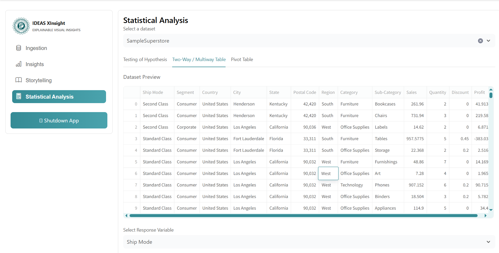
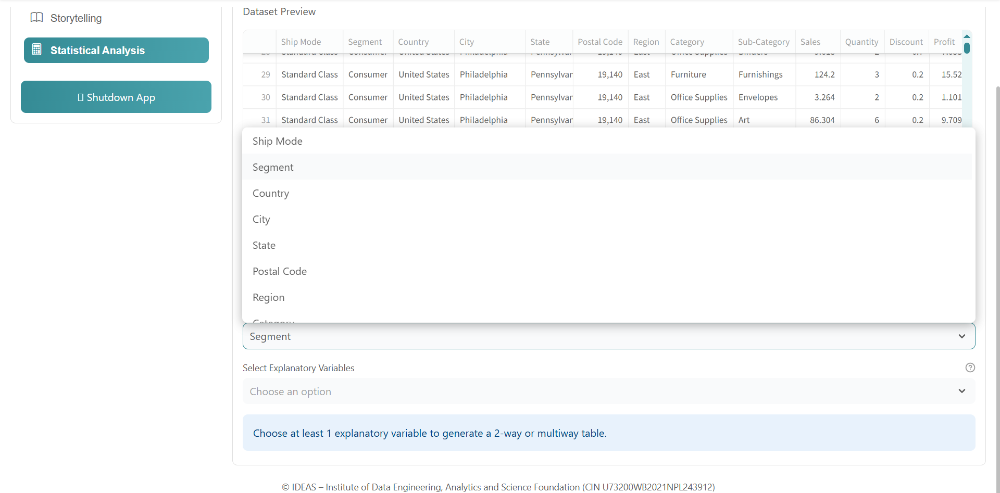
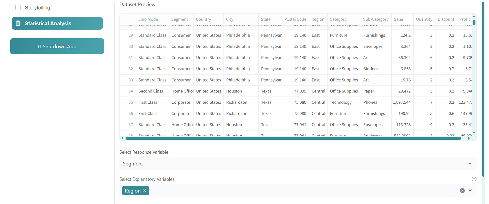
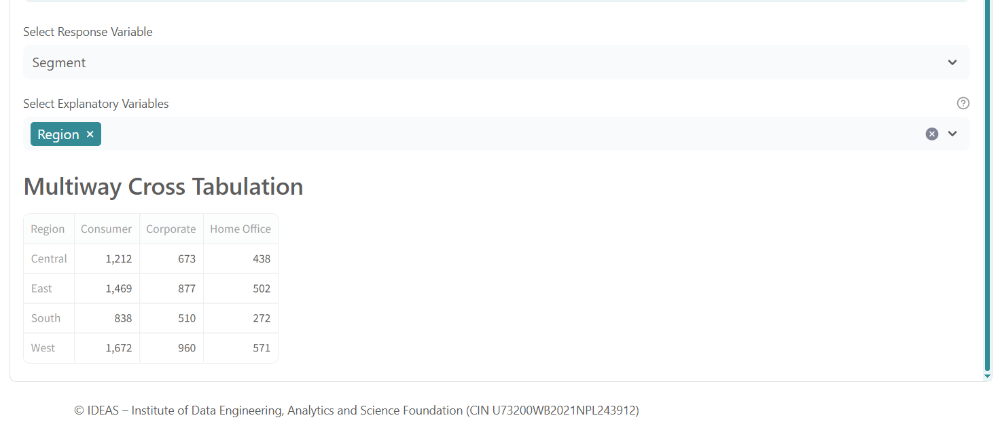
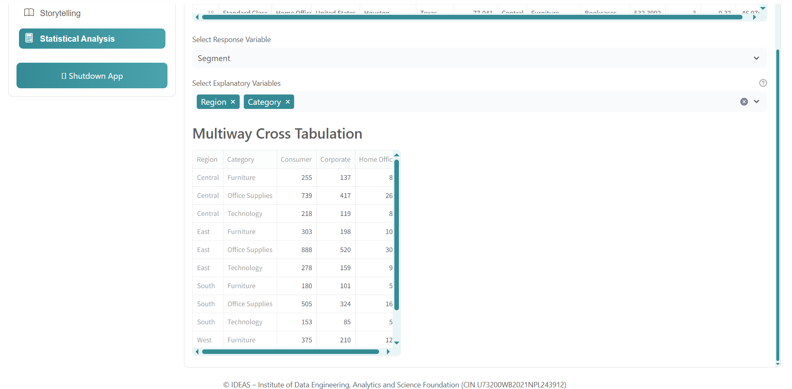

# Two-Way / Multiway Table Guide (Statistical Analysis Section)

Use this guide to create and interpret a **Two-Way / Multiway Table** in the **Statistical Analysis** module.

---

## 1. Open Two-Way / Multiway Table Section

1. Open the app.
2. Go to **Statistical Analysis**.
3. Select your dataset.
4. Open the **Two-Way / Multiway Table** tab.

<!-- Screenshot 1: Full screen showing Statistical Analysis page with Two-Way / Multiway Table tab selected -->

---

## 2. Select Variables

Choose:

- **Response Variable**: target variable for tabulation.
- **Explanatory Variable(s)**: one or more grouping variables.

Tip:

- 1 explanatory variable -> typical **two-way table**.
- 2+ explanatory variables -> **multiway table**.

<!-- Screenshot 2: Variable selectors visible, before running -->

---

## 3. Generate Table

1. Select response and explanatory variable(s).

<!-- Screenshot 3: Inputs filled and ready to generate -->

---

## 4. Understand the Output

The table shows frequency/count distribution by selected variable combinations:

- Rows represent selected explanatory levels (or combinations).
- Columns represent response categories (or vice versa, based on app layout).
- Cells show count/frequency for each combination.

<!-- Screenshot 4: Final generated two-way or multiway output table -->

---

## 5. 3-Way Table Example 

Use this when you want to analyze one response variable across **three explanatory variables**.

Example setup:

- **Response Variable**: `Segment`
- **Explanatory Variable 1**: `Region`
- **Explanatory Variable 2**: `Category`

<!-- Screenshot 5: 3-way example with response + exactly 3 explanatory variables selected and generated output visible -->
---

