# Principal Component Analysis (PCA) – User Guide

This guide explains how to use the **Principal Component Analysis** feature
in the **Statistical Analysis** module.

---

## Step 1: Open Statistical Analysis

1. From the left navigation panel, click **Statistical Analysis**.
2. The **Statistical Analysis** workspace will open.

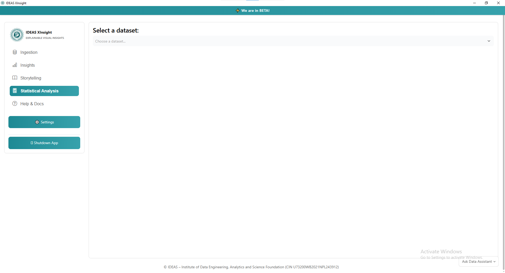
---

## Step 2: Select a Dataset

1. At the top of the page, locate the **Select a Dataset** dropdown.
2. Click the dropdown and choose the dataset you want to analyze.
3. Once selected, the system displays a preview of the first 10 rows of the
   dataset.

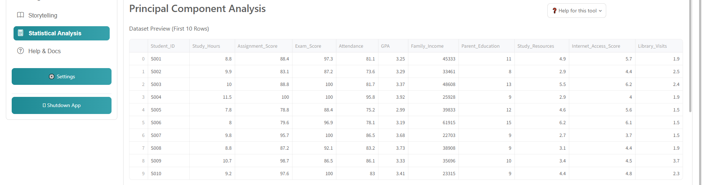
---

## Step 3: Open the Principal Component Analysis Tab

1. In the **Statistical Analysis** section, locate the available analysis
   tabs:
   - Testing of Hypothesis
   - Two-Way / Multiway Table
   - Pivot Table
   - Factor Analysis
   - Principal Component Analysis

2. Click **Principal Component Analysis**.

The PCA page will load.

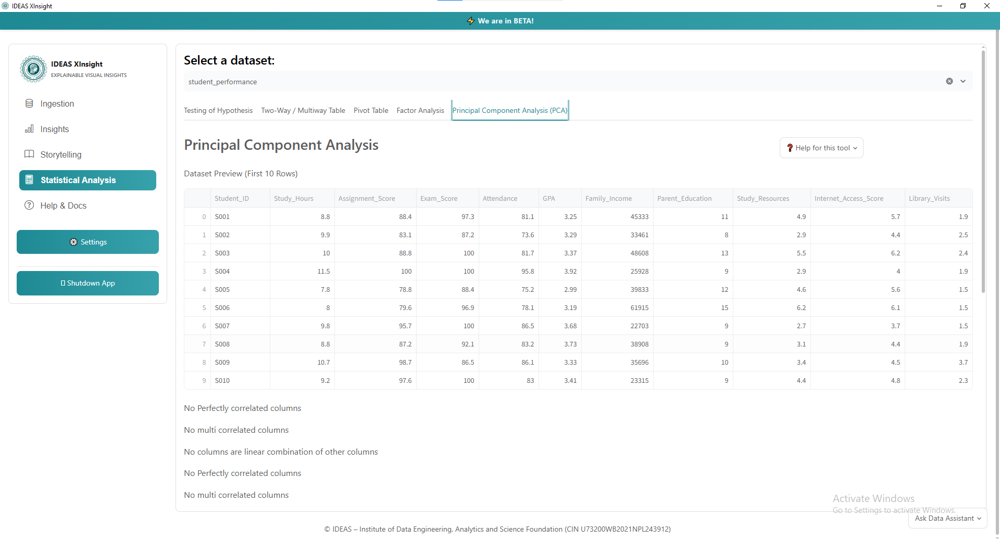
---

## Step 4: Check Dataset Suitability

The system automatically evaluates whether the selected dataset is suitable
for PCA — the same two checks used in Factor Analysis, since both techniques
depend on the data having genuine correlation structure to work with.

### Bartlett's Test

Click **BARTLET**.

The system calculates:

- Chi-square Value
- P-value

A small p-value (≤ 0.05) indicates your variables are correlated enough for
PCA to find anything meaningful.

### KMO Test

Click **KMO**.

The system calculates the **KMO Score**.

### KMO Interpretation

| KMO Value | Result |
| --- | --- |
| Above 0.8 | Excellent |
| 0.7 – 0.8 | Good |
| 0.6 – 0.7 | Acceptable |
| Below 0.5 | Not Recommended |

> A KMO value above **0.5** indicates that PCA can be performed.

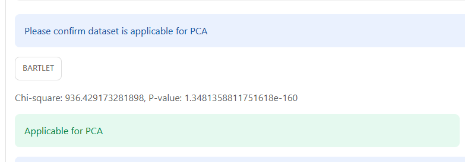

---

## Step 5: Choose the Number of Components

Before fitting, the platform standardizes every numeric column (mean 0,
standard deviation 1) automatically — this matters for PCA specifically,
since a column measured in larger units would otherwise dominate the result
purely from its scale, not from any real pattern in the data. No action is
needed on your part for this step; it happens behind the scenes.

The platform then provides two options for selecting the number of
components.

### Option 1: User Choice

1. Click **User Choice**.
2. Select the desired number of components from the dropdown.

Use this option when you already know how many components you want to keep —
for example, because you specifically need a 2D result for visualization.

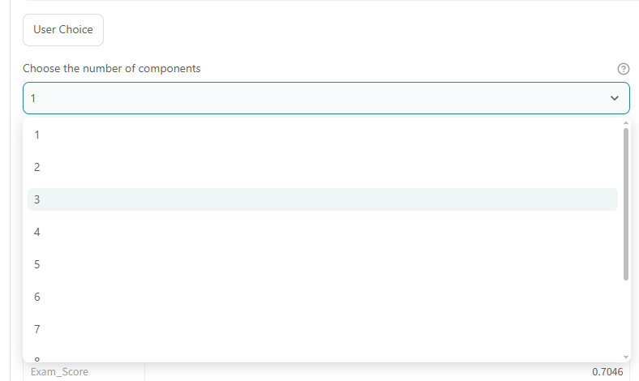
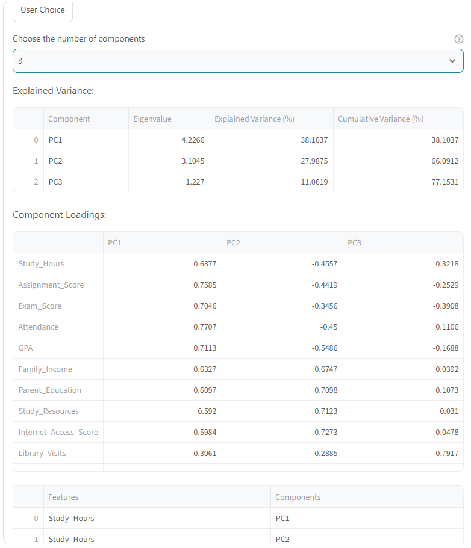
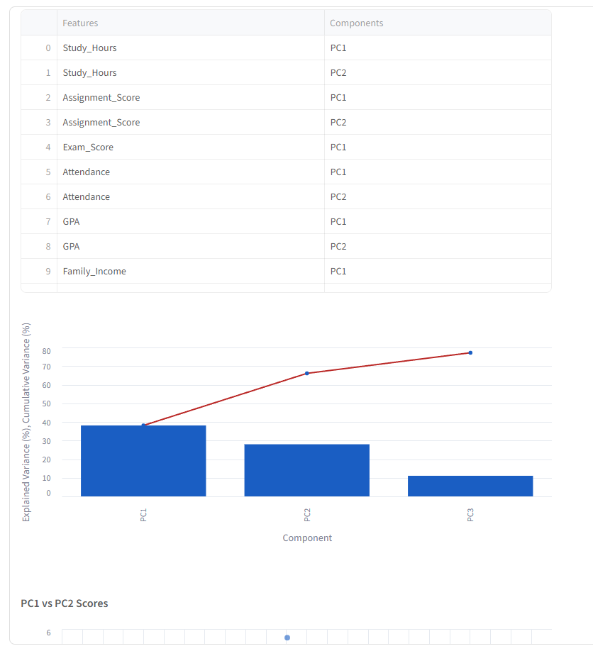
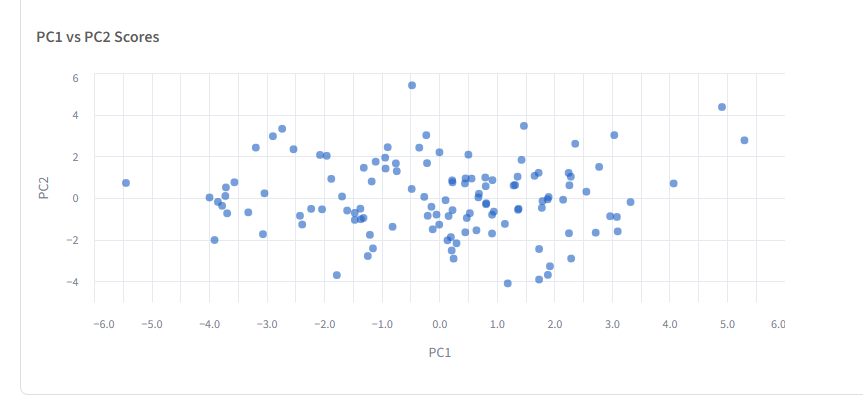
### Option 2: Default

1. Click **Default**.
2. The platform automatically determines the number of components using the
   **Kaiser criterion** — keeping every component with an eigenvalue greater
   than 1.

Use this option if you're unsure how many components should be used.

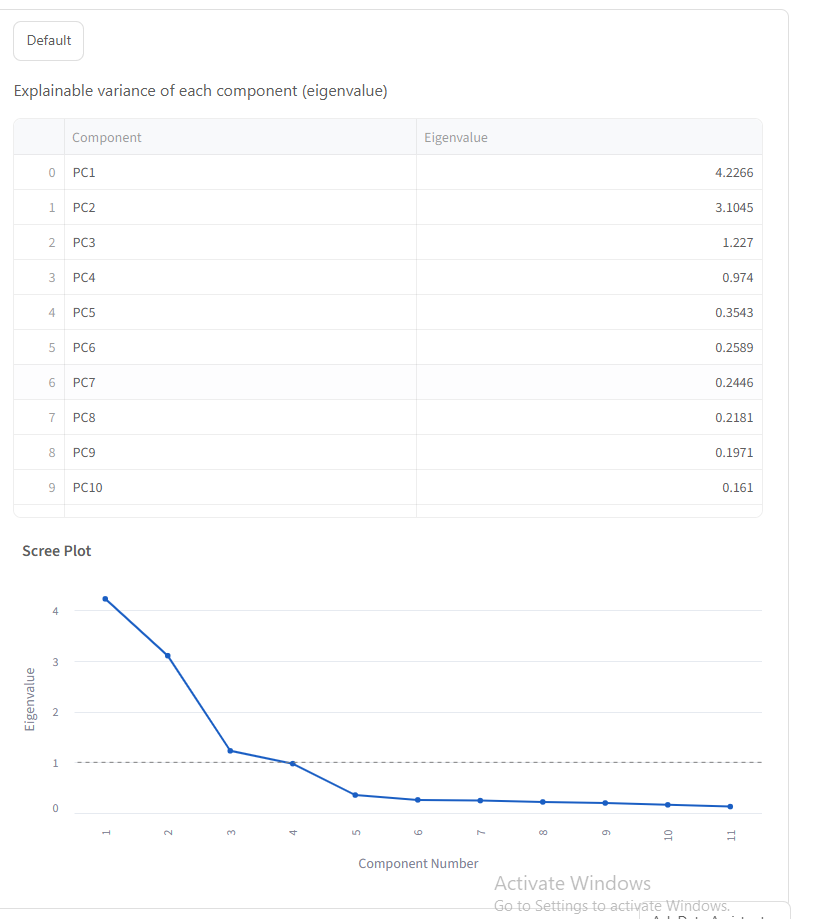
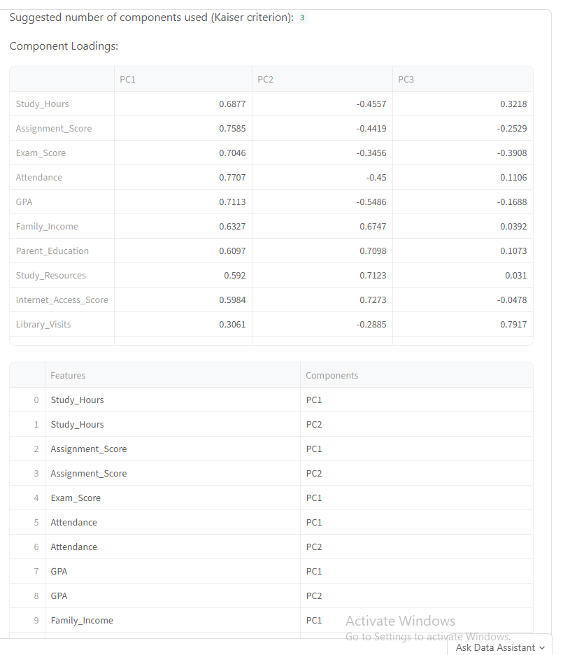
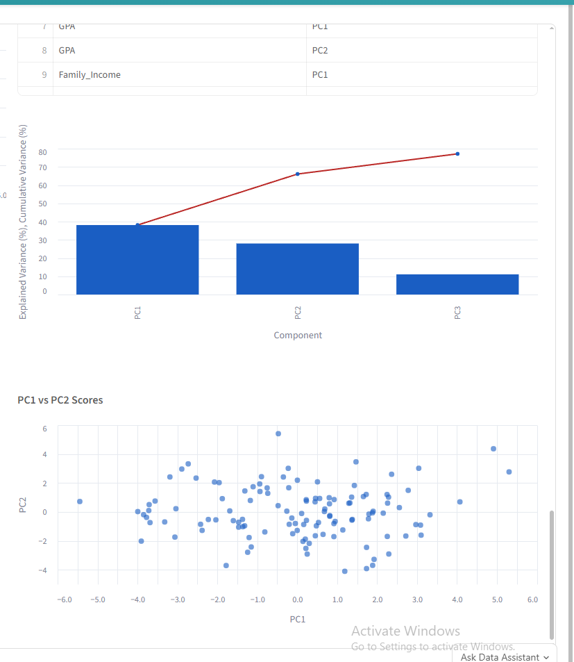
---

## Step 6: Review the Results

Whichever option you chose, PCA produces the same set of outputs:

### Explained Variance

A table showing, per component: its eigenvalue, the percentage of total
variance it explains, and the running cumulative percentage. Alongside it, a
chart shows each component's individual contribution as a bar and the
cumulative total as a line — useful for answering "how many components do I
actually need to capture, say, 90% of the variance?"

### Scree Plot

*(Default option only.)* Eigenvalues plotted in order, with a dashed
reference line at eigenvalue = 1 (the Kaiser criterion cutoff). Look for the
"elbow" where the line flattens out — components past that point usually
aren't worth keeping, even if they were technically included.

### Component Loadings

A table showing how strongly each original variable relates to each
component, followed by a heatmap of the same values for a quicker visual
read. As in Factor Analysis, loadings above roughly 0.4 are generally
considered meaningful — but unlike Factor Analysis, **the sign is arbitrary**
for PCA: a component and its exact mirror image explain identical variance,
so focus on magnitude, not direction.

### Scores Scatter Plot

*(Shown automatically whenever 2 or more components are fit.)* A scatter plot
of every row's position on the first two components (PC1 vs PC2) — this is
where clusters, outliers, or separation between groups tend to become
visually obvious.

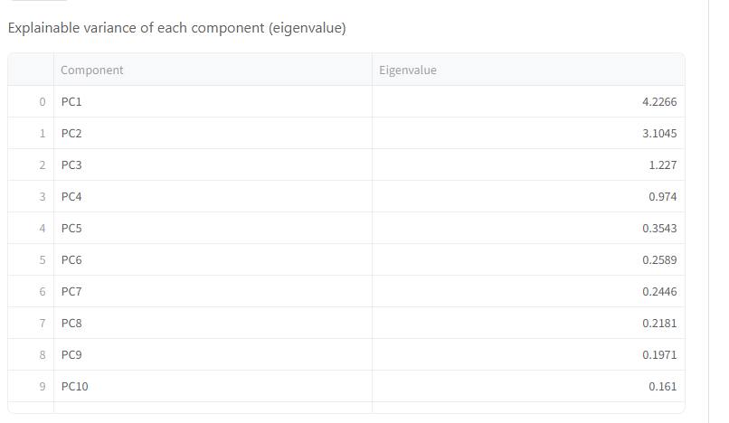
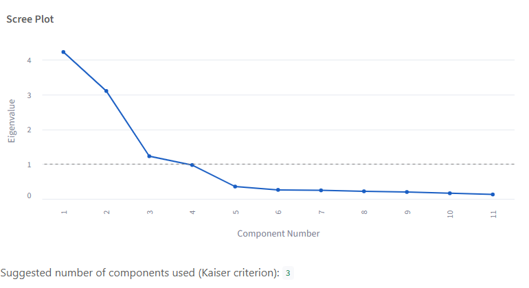
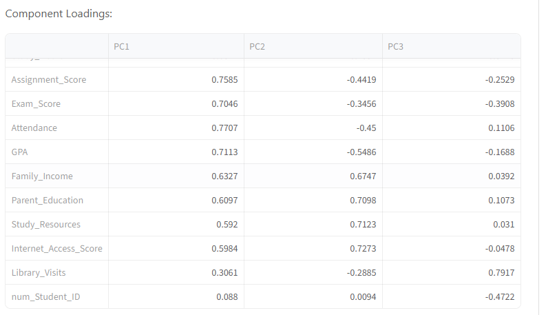
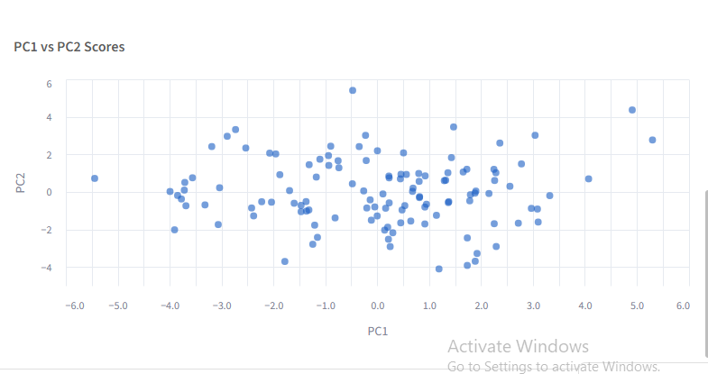
---

## Step 7: Interpret the Components

Analyze the variables grouped under each component, the same way you would
for Factor Analysis — look at the loadings heatmap and identify which
original variables load most strongly (by magnitude) onto each component.

### Example

| Component | Variables |
| --- | --- |
| PC1 | Money, Hour of Day |
| PC2 | Month, Date |
| PC3 | Product-related Variables |

Based on the variables with high loadings, assign a meaningful name to each
component — the same way you would name a factor.

### Example Component Names

- Sales Activity
- Time-Based Trends
- Seasonal Behavior
- Customer Preferences

D
---

## PCA vs. Factor Analysis — Which Should I Use?

Both tabs share the same suitability checks (Bartlett's, KMO) and the same
User Choice / Default workflow, so it's worth being clear on when to reach
for which:

- **PCA** finds the axes that capture the most variance, full stop — it
  makes no assumption about *why* variables correlate. Use it for
  dimensionality reduction, visualization, or removing multicollinearity
  before another model.
- **Factor Analysis** assumes your variables are driven by a smaller number
  of unobserved (latent) factors plus variable-specific noise — it's trying
  to explain *why* variables correlate, not just compress them. Use it when
  you believe there's a real underlying construct (e.g. "customer
  satisfaction") that your measured variables are indirect indicators of.

If you're not sure which applies, PCA is the safer default — it has fewer
assumptions about your data.

---

## Summary

The Principal Component Analysis module reduces a set of correlated numeric
variables down to a smaller number of components that capture most of the
original variance. Before fitting, the platform evaluates dataset suitability
using Bartlett's Test and the KMO Test, and always standardizes your data
first so scale differences between columns don't distort the result. Choose
the number of components yourself, or let the Kaiser criterion pick one
automatically; either way you get an explained-variance breakdown, component
loadings (as both a table and a heatmap), and — with 2 or more components — a
scores scatter plot for spotting structure in your data visually.
