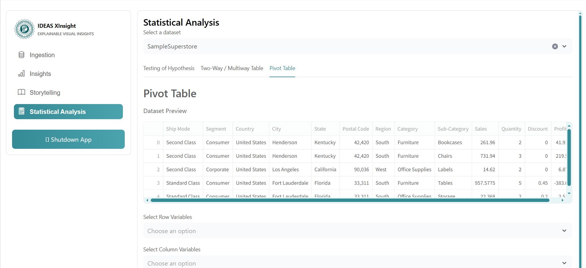
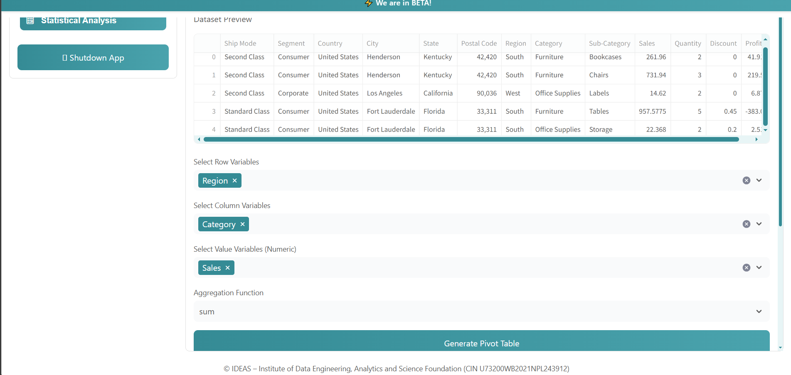
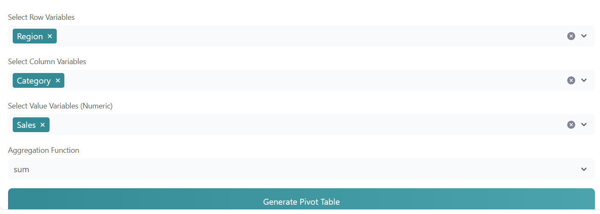
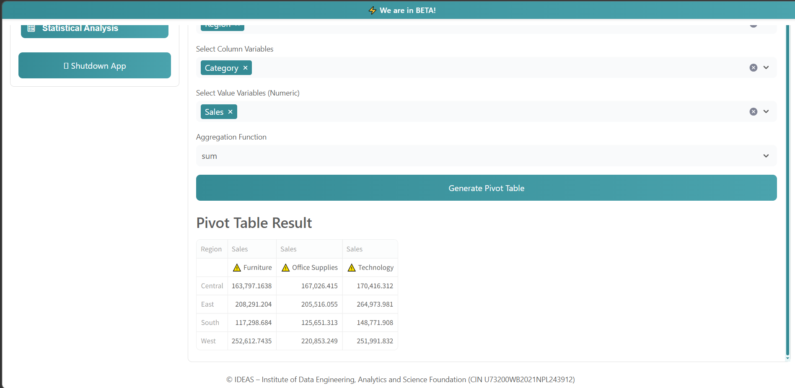

# Pivot Table Guide (Statistical Analysis Section)

Use this guide to create and read a Pivot Table in the **Statistical Analysis -> Pivot Table** tab.

---

## 1. Open Pivot Table Section

1. Open the app.
2. Go to **Statistical Analysis**.
3. Select your dataset.
4. Open the **Pivot Table** tab.

<!-- Screenshot 1: Full screen showing Statistical Analysis page with Pivot Table tab selected -->

---

## 2. Select Pivot Fields

Choose fields as needed:

- **Rows**: category field you want on left side. 
- **Columns**: category field you want across top.
- **Values**: numeric field for calculation.
- **Aggregation**: function such as `Sum`, `Mean`, `Count`, `Min`, `Max`.

<!-- Screenshot 2: Field selectors visible (Rows, Columns, Values, Aggregation) before generating result -->

---

## 3. Generate Pivot Table

1. Select valid row/column/value fields.
2. Choose aggregation method.
3. Click **Generate** (or the action button shown in UI).

<!-- Screenshot 3: Button click moment or ready-to-run selection -->

---

## 4. Understand Output

The resulting table helps compare grouped summaries quickly:

- Each **row** is a group from the Row field.
- Each **column** is a group from the Column field.
- Each cell is the aggregated value for that row-column combination.

<!-- Screenshot 4: Final pivot table result clearly visible -->

---
