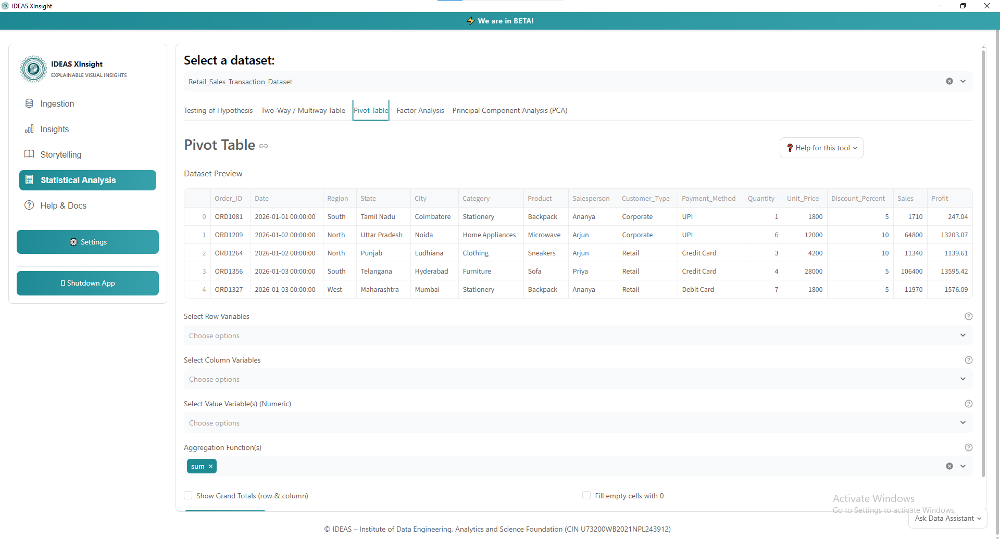
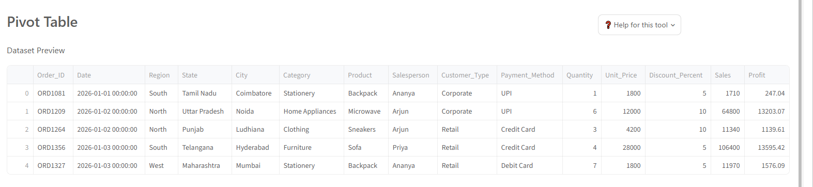
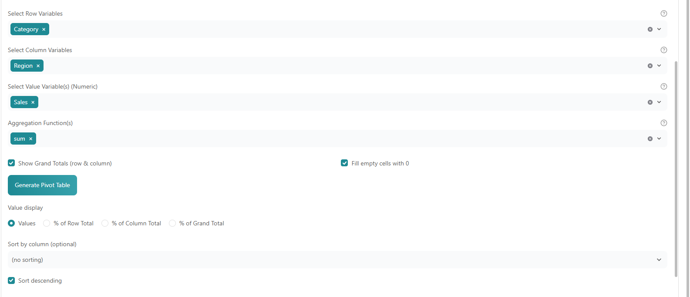
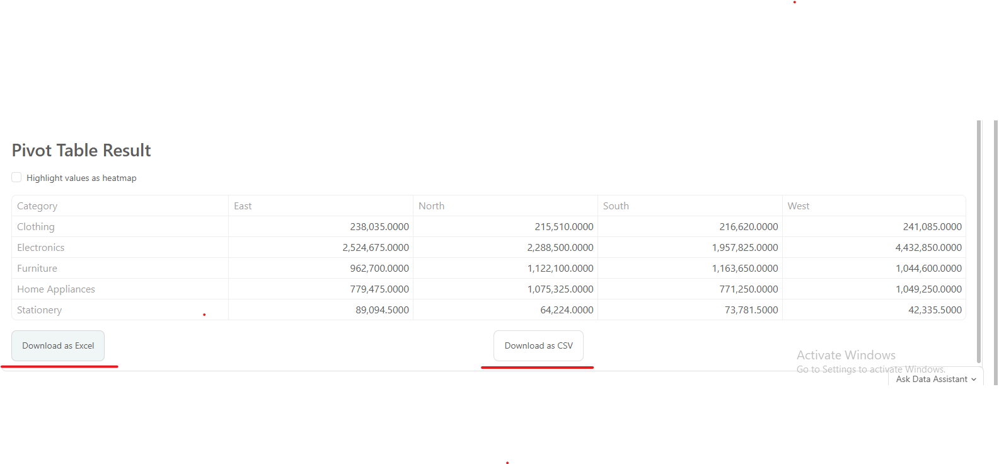

# Pivot Table Guide (Statistical Analysis Section)

Use this guide to summarize your dataset in **Statistical Analysis -> Pivot
Table**.

---

## 1. Open Pivot Table

1. Open the app.
2. Go to **Statistical Analysis**.
3. Select your dataset.
4. Open the **Pivot Table** tab.

---

## 2. Review the Dataset Preview

The top of the page shows a preview of your dataset so you can see column
names and sample values before configuring the pivot.

---

## 3. Configure the Pivot

1. **Select Row Variables** — one or more columns to group by, shown down
   the left side of the result.
2. **Select Column Variables** — one or more columns to group by, shown
   across the top of the result.
3. **Select Value Variable(s) (Numeric)** — the numeric column(s) to
   summarize. Pick more than one to compare several metrics side by side.
4. **Aggregation Function(s)** — how to summarize each group (default:
   `sum`). Pick more than one to see several summaries per cell at once.
5. **Show Grand Totals (row & column)** — adds a `Total` row and column, the
   way a spreadsheet pivot table normally does.
6. **Fill empty cells with 0** — replaces missing combinations with 0
   instead of leaving them blank.
7. Click **Generate Pivot Table**.

### Available Aggregation Functions

| Function | What it shows |
| --- | --- |
| `sum` | Total across the group |
| `mean` / `median` | Typical value in the group |
| `min` / `max` | Smallest / largest value |
| `count` | Rows in the group, ignoring missing values |
| `size` | Rows in the group, including missing values |
| `std` | Spread / variability within the group |

---

## 4. Choose a Value Display Mode

*(Only available with a single Value Variable and a single Aggregation
Function — see the note below.)*

Once the pivot is generated, switch between:

- **Values** — the raw aggregated numbers.
- **% of Row Total**
- **% of Column Total**
- **% of Grand Total**

This lets you see relative contribution instead of absolute size without
regenerating the table.

> If you selected multiple Value Variables or multiple Aggregation
> Functions, this control — and the heatmap in Step 6 — won't appear. With
> several metrics stacked into one table, there's no single number left to
> normalize or color by, so both features are hidden rather than showing a
> misleading partial result.

---

## 5. Sort the Result (optional)

1. Choose a column from **Sort by column (optional)**.
2. Toggle **Sort descending** (on by default).

If **Show Grand Totals** is on, the `Total` row stays pinned at the bottom
regardless of sort order — it always represents the grand total, not a value
to be ranked alongside the rest.

---

## 6. Visualize as a Heatmap

*(Also only available in the single-value, single-aggregation case — see
Step 4.)*

Check **Highlight values as heatmap** to render the pivot result as a colored
grid instead of a plain table — useful for quickly spotting the
largest/smallest cells in a big pivot.

---

## 7. Export

Two download options are always available, regardless of pivot complexity:

- **Download as Excel**
- **Download as CSV**

Both export exactly what's currently displayed — including any sort order or
percentage view you've applied.

---

## Summary

The Pivot Table module builds spreadsheet-style summaries from your dataset —
group by any combination of row and column variables, summarize with one or
more aggregation functions, and optionally add grand totals. When you keep it
simple (one value variable, one aggregation function), you unlock percentage
views and a heatmap on top of the raw numbers. Every result, simple or
complex, can be sorted and exported to Excel or CSV.
