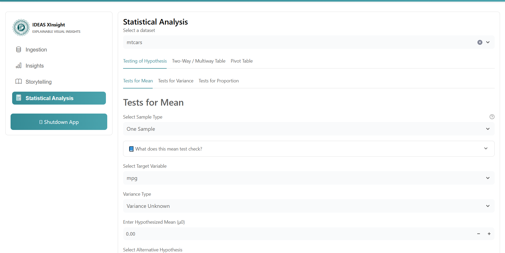
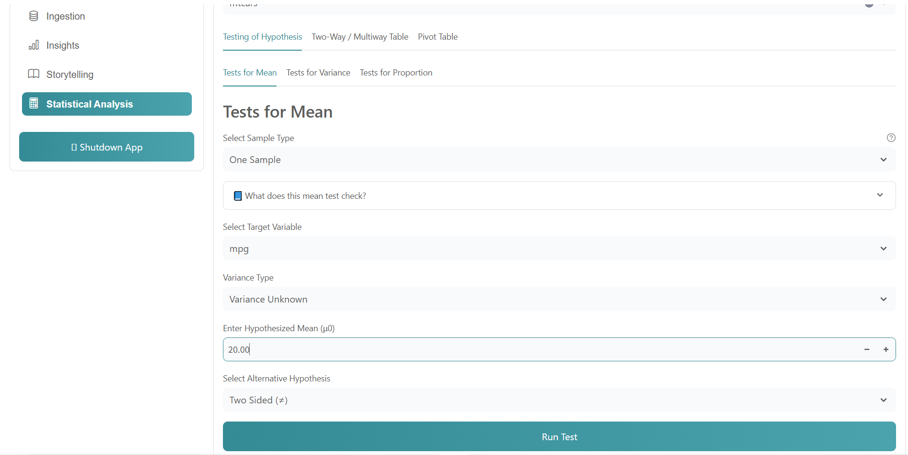
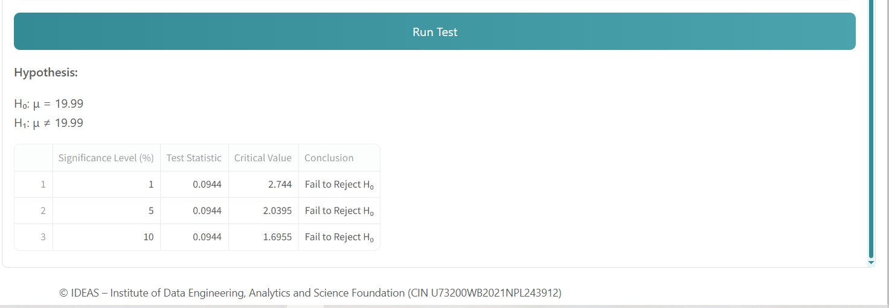
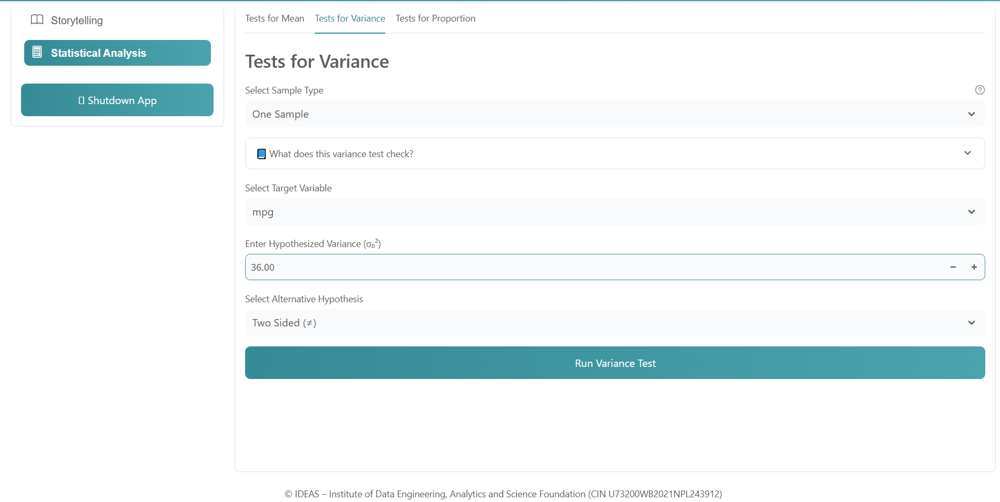
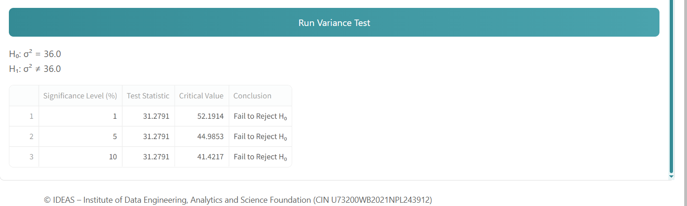

# Testing of Hypothesis Guide (Statistical Analysis Section)

Use this guide to run hypothesis tests in **Statistical Analysis -> Testing of Hypothesis**.

---

## 1. Open Testing of Hypothesis

1. Open the app.
2. Go to **Statistical Analysis**.
3. Select your dataset.
4. Open **Testing of Hypothesis** tab.

<!-- Screenshot 1: Statistical Analysis page with Testing of Hypothesis tab selected -->

---

## 2. Select Test Category

Inside this section, choose one of:

- **Tests for Mean**
- **Tests for Variance**
---

## 2. Mean Test Workflow

1. Open **Tests for Mean**.
2. Select **Sample Type** (`One Sample`, `Two Sample`, or `Paired Sample`).
3. Select variable(s).
4. Select variance type (known/unknown, if shown).
5. Enter hypothesized mean (`mu0`).
6. Select alternative hypothesis.
7. Click **Run Test**.

<!-- Screenshot 3: Mean test inputs filled before Run Test -->

<!-- Screenshot 4: Mean test result table + displayed hypotheses -->

---

## 4. Variance Test Workflow

1. Open **Tests for Variance**.
2. Select sample type.
3. Select variable(s).
4. Enter hypothesized variance value(s), if required.
5. Select alternative hypothesis.
6. Click **Run Test**.

<!-- Screenshot 5: Variance test inputs filled -->

<!-- Screenshot 6: Variance test result table -->

---

## 6. How to Read Result

Focus on:

- **Test Statistic**
- **Critical Value** 
- **Significance Level**
- **Conclusion** (`Reject H0` or `Fail to Reject H0`)

Interpretation rule:

- If result is significant at chosen alpha, reject null hypothesis.
- Otherwise, fail to reject null hypothesis.